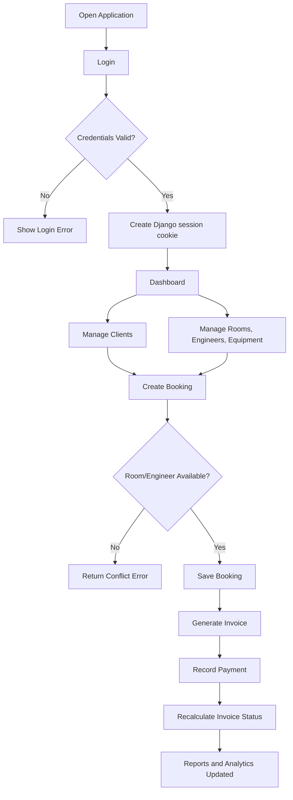
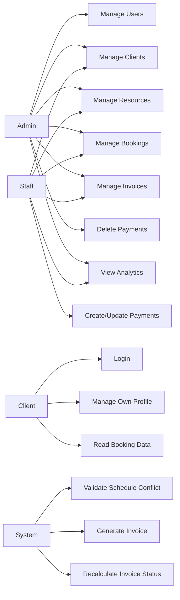
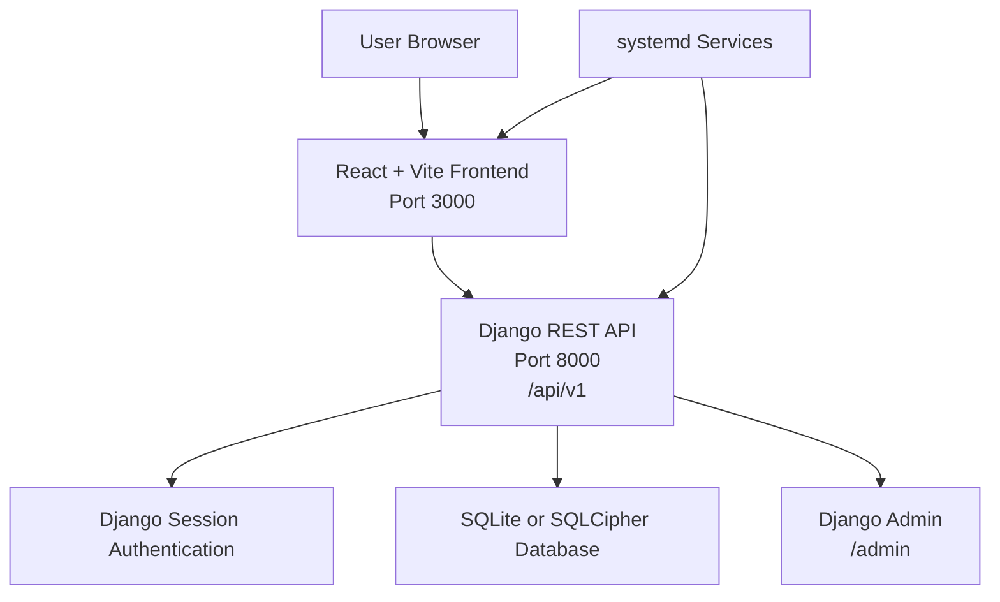
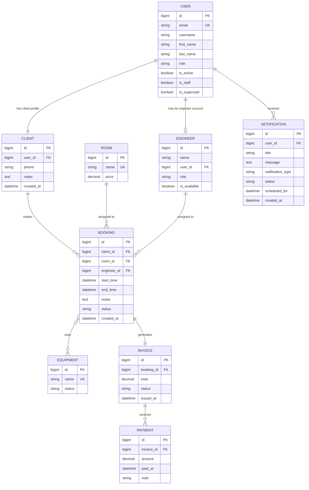

# STEM Studio Documentation

## 1. Application Overview

STEM Studio is a web-based recording studio management application. It helps studio administrators and staff manage customers, studio rooms, engineers, equipment, bookings, invoices, payments, notifications, and dashboard analytics from a single interface.

The application was created to solve common operational problems in a recording studio environment, including schedule conflicts, manual invoice tracking, inconsistent payment status updates, and limited visibility into monthly performance. STEM Studio combines an authenticated React frontend with a Django REST API backend and a SQLite-compatible database layer.

The main users are studio administrators, operational staff, and clients. Administrators and staff operate the system directly through the web dashboard. Clients are represented in the database and can be registered as users, although the current frontend is primarily staff-facing.

## 2. Background

Recording studios usually manage several connected resources: clients, rooms, engineers, equipment, schedules, and payments. If these items are tracked manually, the studio can experience double bookings, delayed payment confirmation, incomplete client records, and limited historical reporting.

STEM Studio addresses these needs by providing:

| Need | Application Support |
|---|---|
| Booking coordination | Booking records with room and engineer conflict validation |
| Client administration | Client CRUD connected to user accounts |
| Resource management | Room, engineer, staff, and equipment management |
| Billing control | Invoice generation, payment recording, and automatic invoice status recalculation |
| Reporting | Dashboard metrics, trends, and monthly invoice summaries |
| Deployment readiness | VPS setup script, Gunicorn configuration, and systemd service files |

## 3. Application Objectives

The main objective of STEM Studio is to provide a centralized operational system for recording studio management.

Specific objectives:

| Objective | Explanation |
|---|---|
| Manage studio clients | Store client identity, contact information, and notes |
| Manage bookings | Create, update, filter, and monitor studio booking schedules |
| Prevent conflicts | Prevent overlapping bookings for the same room or engineer |
| Manage resources | Maintain room pricing, engineer availability, and equipment status |
| Manage billing | Generate invoices from bookings and track payments |
| Provide analytics | Display revenue, utilization, invoice, booking, and client activity metrics |
| Secure access | Use Django session authentication and role-based API permissions |
| Support deployment | Provide local and VPS deployment instructions |

## 4. System Scope

### Included in Scope

| Area | Included Functionality |
|---|---|
| Authentication | CSRF setup, session login, logout, user registration API, profile retrieval, profile update |
| User management | Admin-only user CRUD API |
| Client management | Create, read, update, delete clients |
| Room management | Create, read, update, delete rooms and room pricing |
| Engineer management | Create, read, update, delete engineers and availability |
| Equipment management | Create, read, update, delete equipment and equipment status |
| Booking management | Create bookings, update status, filter by status/date, validate conflicts |
| Invoice management | List invoices, view detail, confirm fully paid invoices, cancel unpaid/partial invoices |
| Payment management | Add, update, delete payments and recalculate invoice status |
| Notifications | API for notification records |
| Analytics | Dashboard metrics, monthly invoice summaries, invoice date ranges, dashboard trends |
| Local scripts | Windows launcher and status/log helper scripts |
| VPS deployment | Ubuntu 22.04 setup script and systemd units |

### Outside Current Scope

| Area | Status |
|---|---|
| Online payment gateway | Not implemented |
| Email/SMS notification delivery | Notification records exist, but delivery workers are not implemented |
| Public client self-service portal | User role exists, but the current UI is primarily internal |
| Docker deployment | No Dockerfile or docker-compose file is present |
| Advanced audit logging | Not implemented as a dedicated audit module |
| File uploads | Not implemented |

## 5. Target Users

| User Group | Needs |
|---|---|
| Studio owner | Revenue visibility, invoice control, utilization reports, high-level operational insight |
| Administrator | Full access to users, clients, bookings, resources, invoices, and payments |
| Staff | Manage daily bookings, clients, rooms, equipment, invoices, and payments |
| Engineer | Represented as a resource assigned to bookings; direct engineer UI is not currently separated |
| Client | Represented as a user/client record; direct frontend self-service is assumed future scope |
| Reviewer/lecturer | Needs clear system structure, business purpose, data model, API behavior, and deployment steps |

## 6. User Roles and Access Rights

The backend defines three roles in `users.models.UserRole`: `admin`, `staff`, and `client`.

| Role | Access Rights | Limitations |
|---|---|---|
| Admin | User CRUD API, client CRUD, resource CRUD, booking CRUD, invoice CRUD/actions, payment CRUD including delete, notification CRUD, Django admin access when staff/superuser flags are set | Must authenticate with Django session |
| Staff | Client CRUD, resource CRUD, booking create/update/delete, invoice CRUD/actions, payment create/update/list, notification CRUD | Cannot delete payments because payment deletion requires admin permission |
| Client | Authenticated read-only booking API access according to backend permission class; profile access | Current frontend does not provide a dedicated client portal; most operational APIs reject client write access |
| Anonymous | Login, registration API, public root status, analytics endpoints currently marked `AllowAny` | Cannot access protected CRUD endpoints |

## 7. Application Features

### 7.1 Authentication and Login

| Item | Description |
|---|---|
| Feature name | Authentication and login |
| Feature objective | Allow authorized users to access the application |
| Actor/user role | Admin, Staff, Client |
| Input | Email and password |
| Process | Frontend requests CSRF, posts credentials to `/api/v1/auth/login/`, and backend creates a Django session |
| Output | User profile response and Django session cookie |
| Validation | Password must match stored hash; backend authenticates through Django auth |
| Technical notes | Frontend sends cookies with `credentials: "include"` and does not store auth tokens in `localStorage` |

### 7.2 Dashboard

| Item | Description |
|---|---|
| Feature name | Dashboard |
| Feature objective | Provide operational and financial summary |
| Actor/user role | Admin, Staff |
| Input | Authenticated page access; analytics API requests |
| Process | Frontend fetches clients, engineers, rooms, recent bookings, dashboard analytics, and dashboard trends |
| Output | KPI cards, trends, booking activity, client activity, API health information |
| Validation | API client throws errors for failed requests |
| Technical notes | Dashboard analytics endpoint is cached for 60 seconds; trend endpoint is cached for 300 seconds |

### 7.3 Client Management

| Item | Description |
|---|---|
| Feature name | Client management |
| Feature objective | Maintain customer records |
| Actor/user role | Admin, Staff |
| Input | Email, first name, last name, phone, notes |
| Process | Frontend calls `/api/v1/clients/`; backend creates a linked client user automatically if no existing user is supplied |
| Output | Client list and saved client profile |
| Validation | Email is required when creating a client without an existing user |
| Technical notes | Client has a one-to-one relationship with `User` |

### 7.4 Booking Management

| Item | Description |
|---|---|
| Feature name | Booking management |
| Feature objective | Schedule studio sessions |
| Actor/user role | Admin, Staff; authenticated users can read bookings |
| Input | Client, room, engineer, optional equipment, start time, end time, notes, status |
| Process | Backend validates date range and checks overlapping room and engineer bookings |
| Output | Booking record and automatically generated invoice |
| Validation | `end_time` must be later than `start_time`; room and engineer cannot overlap with another booking |
| Technical notes | Creating a booking calls `Invoice.objects.get_or_create()` to create an unpaid invoice using room price |

### 7.5 Room Management

| Item | Description |
|---|---|
| Feature name | Room management |
| Feature objective | Maintain studio rooms and prices |
| Actor/user role | Admin, Staff |
| Input | Room name and price |
| Process | Frontend creates/deletes rooms from the booking page; backend stores rooms in the `Room` model |
| Output | Room list available for bookings |
| Validation | Room name must be unique; price is stored as decimal |
| Technical notes | Room deletion may be blocked if protected by existing bookings |

### 7.6 Staff and Engineer Management

| Item | Description |
|---|---|
| Feature name | Staff and engineer management |
| Feature objective | Maintain human resources assigned to sessions |
| Actor/user role | Admin, Staff |
| Input | Name, role, optional user, availability |
| Process | Frontend calls `/api/v1/engineers/`; backend stores engineer/staff resource records |
| Output | Engineer list for bookings and staff-equipment page |
| Validation | Role must be `engineer` or `staff` |
| Technical notes | Engineer can optionally link to a `User` account |

### 7.7 Equipment Management

| Item | Description |
|---|---|
| Feature name | Equipment management |
| Feature objective | Track studio equipment availability |
| Actor/user role | Admin, Staff |
| Input | Equipment name and status |
| Process | Frontend calls `/api/v1/equipment/`; backend stores equipment records |
| Output | Equipment inventory list |
| Validation | Equipment name must be unique; status must be `ready`, `maintenance`, or `busy` |
| Technical notes | Booking model supports many-to-many equipment assignments |

### 7.8 Invoice Management

| Item | Description |
|---|---|
| Feature name | Invoice management |
| Feature objective | Track billing records generated from bookings |
| Actor/user role | Admin, Staff |
| Input | Booking, total, status; action endpoints for confirm/cancel |
| Process | Invoices are listed, filtered, confirmed when fully paid, or cancelled when not paid |
| Output | Invoice list, invoice detail, updated invoice status |
| Validation | Invoice confirmation is rejected when paid amount is lower than total; paid invoices cannot be cancelled directly |
| Technical notes | Invoice has a one-to-one relationship with Booking |

### 7.9 Payment Management

| Item | Description |
|---|---|
| Feature name | Payment management |
| Feature objective | Record payments against invoices |
| Actor/user role | Admin, Staff; deletion is Admin-only |
| Input | Invoice ID, amount, note |
| Process | Backend stores payment and recalculates invoice status inside a transaction |
| Output | Payment record and invoice status `unpaid`, `partial`, or `paid` |
| Validation | Payment amount must be greater than zero; cancelled invoices cannot receive new payments |
| Technical notes | Updating or deleting payments triggers recalculation |

### 7.10 Monthly Report

| Item | Description |
|---|---|
| Feature name | Monthly report |
| Feature objective | Summarize invoice performance by month and year |
| Actor/user role | Admin, Staff |
| Input | Year and selected month |
| Process | Frontend calls analytics monthly summary and invoice list filters |
| Output | Monthly invoice counts, paid/unpaid/cancelled totals, revenue summary, invoice drill-down |
| Validation | Backend accepts numeric year/month query parameters |
| Technical notes | Monthly summary endpoint is cached for 300 seconds |

### 7.11 Settings and Profile

| Item | Description |
|---|---|
| Feature name | Settings and profile |
| Feature objective | Allow users to view and update profile data |
| Actor/user role | Authenticated user |
| Input | First name, last name, optional password |
| Process | Frontend retrieves and patches `/api/v1/auth/profile/` |
| Output | Updated profile and local display name |
| Validation | Password minimum length is 10 if supplied |
| Technical notes | Email and role are read-only in profile serializer |

### 7.12 Notifications

| Item | Description |
|---|---|
| Feature name | Notification records |
| Feature objective | Store reminders and system notification data |
| Actor/user role | Admin, Staff |
| Input | User, title, message, notification type, status, schedule time |
| Process | Backend stores notification records |
| Output | Notification list and detail |
| Validation | Notification type and status must match defined choices |
| Technical notes | Notification delivery service is not implemented in the current repository |

## 8. Application Usage Flow

Typical operational flow:

1. User opens the frontend application.
2. User logs in with email and password.
3. Backend creates a Django session and frontend redirects to dashboard.
4. Staff creates or updates client records.
5. Staff maintains rooms, engineers, and equipment.
6. Staff creates a booking.
7. Backend validates booking conflicts.
8. Backend creates a corresponding unpaid invoice.
9. Staff records one or more payments.
10. Backend recalculates invoice status.
11. Dashboard and monthly reports display updated operational data.



## 9. Use Case Diagram

Use case summary:

| Actor | Use Cases |
|---|---|
| Admin | Manage users, clients, resources, bookings, invoices, payments, notifications, view reports |
| Staff | Manage clients, resources, bookings, invoices, payments, notifications, view reports |
| Client | Login, view profile, read booking data where allowed |
| System | Validate conflicts, generate invoices, recalculate invoice statuses, build analytics |



## 10. System Architecture

STEM Studio uses a separated frontend/backend architecture.

| Layer | Technology | Responsibility |
|---|---|---|
| Frontend | React 19, TypeScript, Vite | User interface, client-side routing, API calls with session cookies |
| Backend API | Django 4.2, Django REST Framework | Business logic, validation, authentication, authorization, persistence |
| Authentication | Django auth sessions | Password validation, login/logout, session cookie validation, CSRF protection |
| Database | SQLCipher-backed SQLite by default; SQLite supported | Persistent storage for users, resources, bookings, billing, notifications |
| Deployment | Gunicorn, systemd, Ubuntu 22.04 script | Production process management on VPS |



## 11. Tech Stack

| Component | Technology | Version/Source | Function |
|---|---|---|---|
| Frontend framework | React | `^19.0.0` | User interface rendering |
| Frontend language | TypeScript | `^5.8.3` | Static typing |
| Build tool | Vite | `^6.3.5` | Development server and production build |
| React plugin | `@vitejs/plugin-react` | `^4.5.0` | React support in Vite |
| Spreadsheet utility | `xlsx` | `^0.18.5` | Spreadsheet-related client utility dependency |
| Backend framework | Django | `4.2.7` | Web framework and ORM |
| API framework | Django REST Framework | `3.17.1` | REST API endpoints and serializers |
| Session authentication | Django auth + DRF SessionAuthentication | Built into Django/DRF | Cookie-based authentication |
| CORS | `django-cors-headers` | `4.9.0` | Cross-origin frontend/backend access |
| Encrypted SQLite | `sqlcipher3` | `0.6.2` | SQLCipher database integration |
| Production WSGI | Gunicorn | `22.0.0` | Backend process server |
| Database | SQLCipher/SQLite | Configurable | Data persistence |
| Deployment OS | Ubuntu | 22.04 script target | VPS deployment |

## 12. Project Folder Structure

```text
stem_studio/
├── backend/
│   ├── analytics/
│   ├── billing/
│   ├── bookings/
│   ├── clients/
│   ├── config/
│   ├── notifications/
│   ├── resources/
│   ├── users/
│   ├── manage.py
│   ├── gunicorn.conf.py
│   └── requirements.txt
├── frontend/
│   ├── app/
│   ├── src/
│   ├── index.html
│   ├── package.json
│   ├── package-lock.json
│   ├── tsconfig.json
│   └── vite.config.ts
├── deploy/
│   └── systemd/
├── scripts/
├── README.md
└── DOCUMENTATION.md
```

| Path | Function |
|---|---|
| `backend/config/settings.py` | Django settings, installed apps, database, session auth, CORS, CSRF, pagination |
| `backend/config/urls.py` | Root URL configuration and `/api/v1/` route registration |
| `backend/config/pagination.py` | Standard DRF pagination with `page_size` query parameter |
| `backend/config/db/backends/sqlcipher/` | Custom SQLCipher database backend wrapper |
| `backend/users/` | Custom user model, roles, auth serializers, permissions, user APIs |
| `backend/clients/` | Client model and CRUD API |
| `backend/resources/` | Room, engineer, and equipment models and APIs |
| `backend/bookings/` | Booking model, validation, invoice creation, booking API |
| `backend/billing/` | Invoice/payment models, payment status services, billing APIs, tests |
| `backend/notifications/` | Notification model and CRUD API |
| `backend/analytics/` | Dashboard and report aggregation services |
| `frontend/app/page.tsx` | Dashboard page |
| `frontend/app/login/page.tsx` | Login page |
| `frontend/app/clients/page.tsx` | Client management page |
| `frontend/app/booking/page.tsx` | Booking and room management page |
| `frontend/app/staff-equipment/page.tsx` | Staff/engineer and equipment management page |
| `frontend/app/invoices/page.tsx` | Invoice list page |
| `frontend/app/invoices/[id]/page.tsx` | Invoice detail and payment page |
| `frontend/app/monthly-report/` | Monthly report pages |
| `frontend/app/settings/page.tsx` | Profile/settings page |
| `frontend/app/lib/api.ts` | Fetch wrapper, CSRF header handling, cookie credentials, pagination helper |
| `frontend/app/lib/router.tsx` | Custom client-side router |
| `deploy/systemd/` | Production service unit templates |
| `scripts/vps_setup_ubuntu2204.sh` | Ubuntu 22.04 deployment automation |
| `scripts/stemstudio*.ps1` and `.bat` | Windows local launcher, status, log, and stop helpers |

## 13. Environment Configuration

### Backend Environment Variables

| Variable name | Function | Example value | Required or optional | Security notes |
|---|---|---|---|---|
| `DJANGO_SECRET_KEY` | Django cryptographic signing key | `replace-with-strong-secret` | Required in production | Must be long, random, and private |
| `DJANGO_DEBUG` | Enables debug mode when `1` | `0` | Required for production clarity | Must be `0` in production |
| `DJANGO_ALLOWED_HOSTS` | Allowed hostnames/IPs | `localhost,127.0.0.1,example.com` | Required in production | Restrict to trusted domains |
| `DJANGO_CORS_ALLOWED_ORIGINS` | Frontend origins allowed to call API | `http://localhost:3000` | Required when frontend origin differs | Do not use broad origins in production |
| `DJANGO_CSRF_TRUSTED_ORIGINS` | Trusted CSRF origins | `http://localhost:3000` | Recommended | Match deployed frontend domains |
| `DB_ENGINE` | Django database engine | `config.db.backends.sqlcipher` | Optional, defaults to SQLCipher backend | Use SQLCipher for encrypted local database |
| `DB_NAME` | Database file or database name | `db.sqlite3` | Optional | Protect file permissions |
| `SQLCIPHER_KEY` | SQLCipher encryption key | `replace-with-strong-sqlcipher-key` | Required when using SQLCipher securely | Must never be committed |
| `DB_CONN_MAX_AGE` | Database persistent connection age | `60` | Optional | Tune for deployment |
| `DB_CONN_HEALTH_CHECKS` | Enables DB health checks | `1` | Optional | Recommended for long-running services |
| `PORT` | Gunicorn bind port | `8000` | Optional | Used by `gunicorn.conf.py` |

### Frontend Environment Variables

| Variable name | Function | Example value | Required or optional | Security notes |
|---|---|---|---|---|
| `VITE_API_BASE_URL` | API base URL used by frontend fetch calls | `http://127.0.0.1:8000` or empty | Optional | Vite exposes `VITE_*` variables to browser; do not store secrets |
| `VITE_API_PROXY_TARGET` | Local Vite proxy target for `/api` | `http://127.0.0.1:8000` | Optional | Development-only proxy target |
| `PORT` | Frontend dev/preview port | `3000` | Optional | Used by Vite config |

## 14. Local Installation

### 14.1 Clone Repository

```powershell
git clone <repository-url> stem_studio
cd stem_studio
```

If the repository is already available locally, enter the project folder:

```powershell
cd "C:\Users\Thinkpad x280\Downloads\ubuntu2204vps01\stem_studio"
```

### 14.2 Install Backend Dependencies

```powershell
cd backend
Copy-Item .env.example .env
py -3 -m pip install -r requirements.txt
```

For local unencrypted SQLite, edit `backend/.env`:

```env
DB_ENGINE=django.db.backends.sqlite3
DB_NAME=db.sqlite3
```

### 14.3 Run Database Migration

```powershell
py -3 manage.py migrate
```

### 14.4 Seed Default Credentials

```powershell
py -3 manage.py seed_credentials
```

Default seeded accounts:

| Role | Email | Password |
|---|---|---|
| Admin | `admin@stemstudio.com` | `4dm1nst3mstvd10` |
| Staff | `staff@stemstudio.com` | `St4ffst3mstvd10` |

These default passwords should be changed before production use.

### 14.5 Start Backend

```powershell
py -3 manage.py runserver 0.0.0.0:8000
```

### 14.6 Install and Start Frontend

Open a new terminal:

```powershell
cd frontend
npm install
npm run dev
```

### 14.7 Access Application

| Service | URL |
|---|---|
| Frontend | `http://localhost:3000` |
| Backend root status | `http://localhost:8000/` |
| API base | `http://localhost:8000/api/v1/` |
| Django admin | `http://localhost:8000/admin/` |

## 15. Running the Frontend

Frontend commands:

| Command | Function |
|---|---|
| `npm install` | Install dependencies |
| `npm run dev` | Start development server on `0.0.0.0:3000` |
| `npm run build` | Type-check and build production assets |
| `npm run preview` | Serve built application on `0.0.0.0:3000` |

Important frontend behavior:

| Item | Description |
|---|---|
| API base | Uses `VITE_API_BASE_URL`; if empty, calls same-origin `/api/...` paths |
| Development proxy | Vite proxies `/api` to `VITE_API_PROXY_TARGET` or `http://127.0.0.1:8000` |
| Authentication storage | Django session cookie; frontend stores no auth token |
| Router | Custom client-side router in `frontend/app/lib/router.tsx` |

Common troubleshooting:

| Issue | Cause | Solution |
|---|---|---|
| Frontend cannot call API | Backend not running or wrong proxy target | Start backend and check `VITE_API_PROXY_TARGET` |
| Port 3000 already in use | Another frontend process is running | Stop the process or set another `PORT` |
| Build fails | TypeScript or dependency issue | Run `npm install`, then `npm run build` and inspect errors |

## 16. Running the Backend

Backend commands:

| Command | Function |
|---|---|
| `py -3 manage.py migrate` | Apply database migrations |
| `py -3 manage.py seed_credentials` | Create/update default admin and staff accounts |
| `py -3 manage.py runserver 0.0.0.0:8000` | Run development server |
| `py -3 manage.py test` | Run backend tests |
| `gunicorn -c gunicorn.conf.py config.wsgi:application` | Run production WSGI server |

Common troubleshooting:

| Issue | Cause | Solution |
|---|---|---|
| `DJANGO_SECRET_KEY must be set` | Production debug disabled but secret missing | Set `DJANGO_SECRET_KEY` in `backend/.env` |
| SQLCipher import error | SQLCipher dependencies missing | Install SQLCipher libraries or use `DB_ENGINE=django.db.backends.sqlite3` locally |
| Migration error | Database schema mismatch | Run migrations from `backend/`; avoid manual schema changes |
| CORS error | Frontend origin not allowed | Update `DJANGO_CORS_ALLOWED_ORIGINS` |

## 17. Database

The application uses Django ORM models. The configured default database engine is `config.db.backends.sqlcipher`, a custom SQLCipher-backed SQLite configuration. Plain SQLite is also supported through `DB_ENGINE=django.db.backends.sqlite3`.

### Tables and Models

| Model | Main Fields | Primary Key | Relationships | Function |
|---|---|---|---|---|
| `User` | `email`, `username`, `first_name`, `last_name`, `role`, `is_active`, `is_staff`, `is_superuser` | `id` | One-to-one with Client and Engineer; one-to-many with Notification | Authentication and role identity |
| `Client` | `user`, `phone`, `notes`, `created_at` | `id` | One-to-one with User; one-to-many with Booking | Customer profile |
| `Room` | `name`, `price` | `id` | One-to-many with Booking | Studio room and price master data |
| `Engineer` | `name`, `user`, `role`, `is_available` | `id` | Optional one-to-one with User; one-to-many with Booking | Staff/engineer resource |
| `Equipment` | `name`, `status` | `id` | Many-to-many with Booking | Equipment inventory |
| `Booking` | `client`, `room`, `engineer`, `equipment`, `start_time`, `end_time`, `notes`, `status`, `created_at` | `id` | Many-to-one with Client, Room, Engineer; many-to-many with Equipment; one-to-one with Invoice | Studio session scheduling |
| `Invoice` | `booking`, `total`, `status`, `issued_at` | `id` | One-to-one with Booking; one-to-many with Payment | Billing record |
| `Payment` | `invoice`, `amount`, `paid_at`, `note` | `id` | Many-to-one with Invoice | Payment record |
| `Notification` | `user`, `title`, `message`, `notification_type`, `status`, `scheduled_for`, `created_at` | `id` | Many-to-one with User | Notification/reminder record |

### Important Indexes

| Model | Indexes |
|---|---|
| Booking | `start_time`, `status`, `room + start_time`, `engineer + start_time`, `client + start_time` |
| Invoice | `status`, `issued_at`, `issued_at + status` |
| Payment | `invoice + paid_at`, `paid_at` |
| Notification | `user + created_at`, `status`, `scheduled_for` |

### Data Flow Between Tables

1. A `User` with role `client` can be connected to a `Client`.
2. A `Booking` references one `Client`, one `Room`, one `Engineer`, and optional `Equipment`.
3. When a `Booking` is created, an `Invoice` is automatically created with `total = room.price`.
4. One or more `Payment` records can be added to an `Invoice`.
5. Invoice status is recalculated from payment totals.
6. Dashboard analytics aggregate data from `Client`, `Booking`, `Engineer`, `Room`, `Invoice`, and `Payment`.

## 18. Entity Relationship Diagram



## 19. API Documentation

All main API endpoints are under `/api/v1/`. List endpoints use page-number pagination and support `page` and `page_size` where enabled by DRF viewsets.

Default request header for protected endpoints:

```http
Cookie: sessionid=<django-session-id>
Content-Type: application/json
```

Standard paginated response:

```json
{
  "count": 1,
  "next": null,
  "previous": null,
  "results": []
}
```

### 19.1 Root Status

| Method | URL | Description | Roles |
|---|---|---|---|
| GET | `/` | Backend status information | Public |

Successful response:

```json
{
  "service": "STEM Studio API",
  "status": "ok",
  "api_base": "/api/v1/",
  "admin": "/admin/"
}
```

### 19.2 Authentication Endpoints

| Method | URL | Description | Roles |
|---|---|---|---|
| GET | `/api/v1/auth/csrf/` | Set/read CSRF token cookie for session login | Public |
| POST | `/api/v1/auth/login/` | Log in and create Django session | Public with CSRF |
| POST | `/api/v1/auth/logout/` | Log out and destroy Django session | Authenticated with CSRF |
| GET | `/api/v1/auth/me/` | Get current session user profile | Authenticated |
| POST | `/api/v1/auth/register/` | Register user | Public |
| GET | `/api/v1/auth/profile/` | Get current user profile | Authenticated |
| PATCH | `/api/v1/auth/profile/` | Update current profile | Authenticated |

Login request:

```json
{
  "email": "admin@stemstudio.com",
  "password": "4dm1nst3mstvd10"
}
```

Login success response:

```json
{
  "id": 1,
  "email": "admin@stemstudio.com",
  "first_name": "Admin",
  "last_name": "Stemstudio",
  "role": "admin"
}
```

The browser receives a Django session cookie. The frontend does not store auth tokens in `localStorage`.

Profile update request:

```json
{
  "first_name": "Admin",
  "last_name": "Studio",
  "password": "NewStrongPass123"
}
```

Validation notes:

| Field | Rule |
|---|---|
| `email` | Unique user email |
| `password` | Minimum length 10 |
| `role` | `admin`, `staff`, or `client` |

### 19.3 Users

| Method | URL | Description | Roles |
|---|---|---|---|
| GET | `/api/v1/users/` | List users | Admin |
| POST | `/api/v1/users/` | Create user | Admin |
| GET | `/api/v1/users/{id}/` | Retrieve user | Admin |
| PUT/PATCH | `/api/v1/users/{id}/` | Update user | Admin |
| DELETE | `/api/v1/users/{id}/` | Delete user | Admin |

Request body example:

```json
{
  "email": "staff@example.com",
  "first_name": "Studio",
  "last_name": "Staff",
  "role": "staff",
  "is_active": true
}
```

### 19.4 Clients

| Method | URL | Description | Roles |
|---|---|---|---|
| GET | `/api/v1/clients/` | List clients | Admin, Staff |
| POST | `/api/v1/clients/` | Create client | Admin, Staff |
| GET | `/api/v1/clients/{id}/` | Retrieve client | Admin, Staff |
| PUT/PATCH | `/api/v1/clients/{id}/` | Update client | Admin, Staff |
| DELETE | `/api/v1/clients/{id}/` | Delete client | Admin, Staff |

Create request:

```json
{
  "email": "client@example.com",
  "first_name": "Client",
  "last_name": "Example",
  "phone": "08123456789",
  "notes": "Preferred evening sessions"
}
```

Success response:

```json
{
  "id": 1,
  "user": 2,
  "user_email": "client@example.com",
  "first_name": "Client",
  "last_name": "Example",
  "phone": "08123456789",
  "notes": "Preferred evening sessions",
  "created_at": "2026-06-20T10:00:00+07:00"
}
```

### 19.5 Rooms

| Method | URL | Description | Roles |
|---|---|---|---|
| GET | `/api/v1/rooms/` | List rooms | Admin, Staff |
| POST | `/api/v1/rooms/` | Create room | Admin, Staff |
| GET | `/api/v1/rooms/{id}/` | Retrieve room | Admin, Staff |
| PUT/PATCH | `/api/v1/rooms/{id}/` | Update room | Admin, Staff |
| DELETE | `/api/v1/rooms/{id}/` | Delete room | Admin, Staff |

Create request:

```json
{
  "name": "Studio A",
  "price": "250000.00"
}
```

### 19.6 Engineers

| Method | URL | Description | Roles |
|---|---|---|---|
| GET | `/api/v1/engineers/` | List engineers/staff resources | Admin, Staff |
| POST | `/api/v1/engineers/` | Create engineer/staff resource | Admin, Staff |
| GET | `/api/v1/engineers/{id}/` | Retrieve engineer | Admin, Staff |
| PUT/PATCH | `/api/v1/engineers/{id}/` | Update engineer | Admin, Staff |
| DELETE | `/api/v1/engineers/{id}/` | Delete engineer | Admin, Staff |

Create request:

```json
{
  "name": "Engineer A",
  "role": "engineer",
  "user": null,
  "is_available": true
}
```

### 19.7 Equipment

| Method | URL | Description | Roles |
|---|---|---|---|
| GET | `/api/v1/equipment/` | List equipment | Admin, Staff |
| POST | `/api/v1/equipment/` | Create equipment | Admin, Staff |
| GET | `/api/v1/equipment/{id}/` | Retrieve equipment | Admin, Staff |
| PUT/PATCH | `/api/v1/equipment/{id}/` | Update equipment | Admin, Staff |
| DELETE | `/api/v1/equipment/{id}/` | Delete equipment | Admin, Staff |

Create request:

```json
{
  "name": "Microphone Set A",
  "status": "ready"
}
```

Allowed status values: `ready`, `maintenance`, `busy`.

### 19.8 Bookings

| Method | URL | Description | Roles |
|---|---|---|---|
| GET | `/api/v1/bookings/` | List bookings | Authenticated |
| POST | `/api/v1/bookings/` | Create booking | Admin, Staff |
| GET | `/api/v1/bookings/{id}/` | Retrieve booking | Authenticated |
| PUT/PATCH | `/api/v1/bookings/{id}/` | Update booking | Admin, Staff |
| DELETE | `/api/v1/bookings/{id}/` | Delete booking | Admin, Staff |

Query parameters:

| Parameter | Description |
|---|---|
| `status` | Filter by booking status |
| `start_date` | Filter bookings starting on or after date |
| `end_date` | Filter bookings starting on or before date |

Create request:

```json
{
  "client": 1,
  "room": 1,
  "engineer": 1,
  "equipment": [1, 2],
  "start_time": "2026-06-20T13:00:00+07:00",
  "end_time": "2026-06-20T15:00:00+07:00",
  "notes": "Vocal recording session",
  "status": "pending"
}
```

Validation notes:

| Validation | Error Condition |
|---|---|
| Date order | `start_time >= end_time` |
| Room conflict | Existing booking overlaps same room |
| Engineer conflict | Existing booking overlaps same engineer |

### 19.9 Invoices

| Method | URL | Description | Roles |
|---|---|---|---|
| GET | `/api/v1/invoices/` | List invoices | Admin, Staff |
| POST | `/api/v1/invoices/` | Create invoice | Admin, Staff |
| GET | `/api/v1/invoices/{id}/` | Retrieve invoice | Admin, Staff |
| PUT/PATCH | `/api/v1/invoices/{id}/` | Update invoice | Admin, Staff |
| DELETE | `/api/v1/invoices/{id}/` | Delete invoice | Admin, Staff |
| POST | `/api/v1/invoices/{id}/confirm/` | Confirm invoice as paid | Admin, Staff |
| POST | `/api/v1/invoices/{id}/cancel/` | Cancel invoice and booking | Admin, Staff |

Query parameters:

| Parameter | Description |
|---|---|
| `booking` | Filter by booking ID |
| `status` | Filter by invoice status |
| `year` | Filter by issue year |
| `month` | Filter by issue month |

Invoice response:

```json
{
  "id": 1,
  "booking": 1,
  "total": "250000.00",
  "status": "partial",
  "issued_at": "2026-06-20T10:00:00+07:00",
  "paid_amount": "100000.00"
}
```

Invoice confirm errors:

| Status code | Condition |
|---|---|
| 400 | Invoice is cancelled |
| 400 | Paid amount is lower than invoice total |

Invoice cancel errors:

| Status code | Condition |
|---|---|
| 400 | Invoice is already paid |

### 19.10 Payments

| Method | URL | Description | Roles |
|---|---|---|---|
| GET | `/api/v1/payments/` | List payments | Admin, Staff |
| POST | `/api/v1/payments/` | Create payment | Admin, Staff |
| GET | `/api/v1/payments/{id}/` | Retrieve payment | Admin, Staff |
| PUT/PATCH | `/api/v1/payments/{id}/` | Update payment | Admin, Staff |
| DELETE | `/api/v1/payments/{id}/` | Delete payment | Admin only |

Query parameters:

| Parameter | Description |
|---|---|
| `invoice` | Filter payments by invoice ID |

Create request:

```json
{
  "invoice": 1,
  "amount": "100000.00",
  "note": "Down payment"
}
```

Validation notes:

| Validation | Rule |
|---|---|
| Amount | Must be greater than zero |
| Invoice status | Cancelled invoices cannot receive new payments |
| Recalculation | Invoice status updates after create/update/delete |

### 19.11 Notifications

| Method | URL | Description | Roles |
|---|---|---|---|
| GET | `/api/v1/notifications/` | List notifications | Admin, Staff |
| POST | `/api/v1/notifications/` | Create notification | Admin, Staff |
| GET | `/api/v1/notifications/{id}/` | Retrieve notification | Admin, Staff |
| PUT/PATCH | `/api/v1/notifications/{id}/` | Update notification | Admin, Staff |
| DELETE | `/api/v1/notifications/{id}/` | Delete notification | Admin, Staff |

Create request:

```json
{
  "user": 1,
  "title": "Booking Reminder",
  "message": "Session starts soon.",
  "notification_type": "booking_reminder",
  "status": "pending",
  "scheduled_for": "2026-06-20T12:30:00+07:00"
}
```

Allowed notification types: `booking_reminder`, `payment_reminder`, `system`.

Allowed statuses: `pending`, `sent`, `failed`.

### 19.12 Analytics

| Method | URL | Description | Roles |
|---|---|---|---|
| GET | `/api/v1/analytics/dashboard/` | Dashboard KPI payload | Public by current backend setting |
| GET | `/api/v1/analytics/monthly-invoice-summary/?year=2026` | Monthly invoice summary for a year | Public by current backend setting |
| GET | `/api/v1/analytics/invoice-date-range/` | Oldest/newest invoice date | Public by current backend setting |
| GET | `/api/v1/analytics/dashboard-trends/` | 12-month revenue and booking trends | Public by current backend setting |

Dashboard response fields:

| Field | Description |
|---|---|
| `period` | Current period in `YYYY-MM` |
| `monthly_revenue` | Payment total for current month |
| `yearly_revenue` | Payment total for current year |
| `total_revenue` | All-time payment total |
| `utilization_percent` | Estimated room utilization |
| `active_clients` | Client count |
| `unpaid_invoices` | Count of invoices not marked paid |
| `total_invoices` | Invoice count |
| `paid_invoices` | Paid invoice count |
| `pending_bookings` | Pending booking count |
| `todays_bookings` | Bookings starting today |
| `available_engineers` | Available engineer count |
| `total_engineers` | Total engineer count |
| `client_activity` | Top client activity list |

## 20. Authentication and Authorization

STEM Studio uses Django's built-in authentication system with browser session cookies, Django password hashing, and CSRF protection.

### Login

1. User submits email and password.
2. Frontend first requests `/api/v1/auth/csrf/` to receive a CSRF cookie.
3. Frontend sends a POST request to `/api/v1/auth/login/` with `credentials: "include"` and `X-CSRFToken`.
4. Backend validates credentials with Django `authenticate()` and creates a Django session with `login()`.
5. Subsequent API requests send the HttpOnly session cookie automatically with `credentials: "include"`.

### Session Lifetime

| Session Setting | Value |
|---|---|
| Session cookie age | 30 minutes |
| Expire at browser close | Enabled |

### Protected Routes

The frontend wraps application pages with `AuthGate`. It calls `/api/v1/auth/me/`; unauthenticated users are redirected to `/login`.

### Role-Based Authorization

Backend permission classes:

| Permission class | Rule |
|---|---|
| `IsAdmin` | User must be authenticated and role must be `admin` |
| `IsAdminOrStaff` | User must be authenticated and role must be `admin` or `staff` |
| `IsAdminStaffOrReadOnly` | Authenticated users may read; only admin/staff may write |

### Logout

The frontend sends `POST /api/v1/auth/logout/` with CSRF protection. Django destroys the session server-side and the frontend redirects to `/login`.

## 21. Data Validation

### Frontend Validation

Frontend pages collect required fields and handle API errors. Validation is primarily enforced by backend serializers and model constraints.

### Backend Validation

| Area | Validation |
|---|---|
| Registration | Password minimum length 10 |
| Profile | Password minimum length 10; email and role read-only |
| Client creation | Email required if no existing user is provided |
| Booking | Start/end/room/engineer required; end must be after start; room and engineer cannot overlap |
| Room | Name unique; price decimal |
| Equipment | Name unique; status choice |
| Engineer | Role choice |
| Invoice confirm | Cannot confirm cancelled or not fully paid invoice |
| Invoice cancel | Cannot directly cancel paid invoice |
| Payment | Amount must be positive; cancelled invoice cannot receive payment |
| Notification | Notification type and status choices |

## 22. Error Handling

| Error Type | Handling |
|---|---|
| Validation errors | DRF serializers return `400 Bad Request` with field or detail messages |
| Authentication errors | DRF returns `403 Forbidden` when the Django session is missing or invalid |
| Authorization errors | Permission classes return `403 Forbidden` when authenticated user lacks role |
| Server errors | Django returns `500 Internal Server Error`; production should disable debug output |
| Database errors | ORM exceptions may occur for protected relations, uniqueness, or connection problems |
| API errors | Frontend `apiFetch` throws an error containing response text or status |
| Permission errors | Backend role permissions block restricted endpoints |

Recommended frontend error display pattern:

1. Show a user-friendly message.
2. Preserve the technical error in console or logs for developers.
3. Avoid exposing sensitive stack traces to end users.

## 23. Application Security

| Security Aspect | Current Implementation | Recommendation |
|---|---|---|
| Password storage | Django `set_password()` uses secure password hashing | Keep Django password validators enabled |
| Secret management | Backend reads `.env`; production requires `DJANGO_SECRET_KEY` | Never commit real `.env` values |
| Session authentication | Django auth session cookie | Keep session age short for shared studio machines |
| Token storage | Frontend stores no auth token | Keep cookies secure and CSRF trusted origins aligned with deployed domains |
| CORS | Configurable `DJANGO_CORS_ALLOWED_ORIGINS`; optional allow-all in debug edge case | Restrict origins in production |
| CSRF | Django CSRF middleware enabled; unsafe requests send `X-CSRFToken` | Keep trusted origins aligned with deployed frontend |
| SQL injection | Django ORM and serializers reduce SQL injection risk | Avoid raw SQL unless parameterized |
| XSS prevention | React escapes rendered values by default | Avoid unsafe HTML rendering |
| File upload security | File uploads are not implemented | Validate type/size/storage if added |
| Rate limiting | Not implemented | Add throttling for login and public analytics endpoints |
| Database encryption | SQLCipher backend available | Use strong `SQLCIPHER_KEY` in production |
| Data backup | Not automated in repository | Schedule encrypted database backups |
| Logging | Gunicorn logs to stdout/stderr; scripts capture local logs | Add centralized production log retention |
| User access control | Role permissions implemented in API | Review analytics endpoints because they are currently public |

## 24. Deployment

The repository includes an Ubuntu 22.04 setup script and systemd service templates.

### 24.1 Server Preparation

The VPS setup script installs:

| Package/Tool | Purpose |
|---|---|
| Python 3, venv, pip | Backend runtime |
| SQLCipher and development libraries | Encrypted SQLite support |
| Node.js 20 | Frontend build/preview runtime |
| Nginx | Public reverse proxy for frontend, `/api/`, and `/admin/` |
| Gunicorn | Backend WSGI server |

### 24.2 Deployment Command

```bash
cd stem_studio
chmod +x scripts/vps_setup_ubuntu2204.sh
PUBLIC_HOST=<DOMAIN_NAME> \
SQLCIPHER_KEY='<STRONG_SQLCIPHER_KEY>' \
bash scripts/vps_setup_ubuntu2204.sh
sudo certbot --nginx -d <DOMAIN_NAME>
```

`PUBLIC_HOST` should be a domain with a DNS `A` record pointing to the VPS IP.
Do not use the raw VPS IP as the user-facing URL for production.

### 24.3 Default VPS Update From GitHub

Use this runbook when the VPS already has a working checkout and you want to deploy the latest repository changes.

Assumptions:

| Item | Default |
|---|---|
| Project path | `/home/<user>/stem_studio` or the existing checkout directory |
| Branch | `codex/fix-vite-api-proxy-clean` |
| Remote | `target-rewrite` if present, otherwise `origin` |
| Backend service | `stem-backend` |
| Frontend service | `stem-frontend` |

1. SSH into the VPS and enter the project directory.

```bash
ssh <user>@<vps-ip-or-domain>
cd /home/<user>/stem_studio
```

2. Confirm there are no local production edits that would be overwritten.

```bash
git status --short --branch
```

If this shows modified files that were edited directly on the VPS, stop and back them up before pulling.

3. Fetch the latest repository state.

```bash
git fetch --all --prune
```

4. Choose the remote that exists on the VPS.

```bash
git remote -v
```

If the VPS has `target-rewrite`, use:

```bash
git checkout codex/fix-vite-api-proxy-clean
git pull --ff-only target-rewrite codex/fix-vite-api-proxy-clean
```

If the VPS only has `origin`, use:

```bash
git checkout codex/fix-vite-api-proxy-clean
git pull --ff-only origin codex/fix-vite-api-proxy-clean
```

If the branch does not exist locally yet, create it from the remote:

```bash
git checkout -b codex/fix-vite-api-proxy-clean target-rewrite/codex/fix-vite-api-proxy-clean
```

Use `origin/codex/fix-vite-api-proxy-clean` instead if the VPS only has `origin`.

5. Update backend dependencies and database.

```bash
cd backend
./.venv/bin/python -m pip install -r requirements.txt
./.venv/bin/python manage.py check
./.venv/bin/python manage.py migrate
./.venv/bin/python manage.py test users
```

6. Rebuild the frontend.

```bash
cd ../frontend
npm ci
npm run build
```

7. Restart services.

```bash
sudo systemctl restart stem-backend
sudo systemctl restart stem-frontend
```

8. Verify services and logs.

```bash
sudo systemctl status stem-backend --no-pager
sudo systemctl status stem-frontend --no-pager
sudo journalctl -u stem-backend -n 80 --no-pager
sudo journalctl -u stem-frontend -n 80 --no-pager
```

9. Verify from the browser.

Open `https://<DOMAIN_NAME>/login`, sign in with an existing Django user, then check dashboard data. Because authentication uses Django session cookies, clear old site data/cookies if the browser previously used the old token login.

Rollback:

```bash
git log --oneline -5
git reset --hard <previous-good-commit>
cd backend && ./.venv/bin/python manage.py migrate
cd ../frontend && npm ci && npm run build
sudo systemctl restart stem-backend stem-frontend
```

### 24.4 Backend Production Setup

The script:

1. Creates `backend/.venv` if missing.
2. Installs backend dependencies.
3. Generates `backend/.env`.
4. Runs migrations.
5. Installs a systemd backend service.

Backend service:

| Item | Value |
|---|---|
| Service file | `/etc/systemd/system/stem-backend.service` |
| Working directory | `__PROJECT_ROOT__/backend` |
| Command | `gunicorn -c backend/gunicorn.conf.py config.wsgi:application` |
| Default port | `8000` |

### 24.5 Frontend Production Setup

The script:

1. Runs `npm ci`.
2. Runs `npm run build`.
3. Installs a systemd frontend service.
4. Runs `npm run preview` on port `3000`.

Frontend service:

| Item | Value |
|---|---|
| Service file | `/etc/systemd/system/stem-frontend.service` |
| Working directory | `__PROJECT_ROOT__/frontend` |
| Command | `npm run preview` |
| Default port | `3000` |

### 24.6 Domain, Reverse Proxy, and HTTPS

The setup script installs Nginx and writes a production reverse proxy for the configured `PUBLIC_HOST`. A manual proxy should look similar to:

```nginx
server {
    listen 80;
    server_name example.com;

    location /api/ {
        proxy_pass http://127.0.0.1:8000;
        proxy_set_header Host $host;
        proxy_set_header X-Real-IP $remote_addr;
        proxy_set_header X-Forwarded-For $proxy_add_x_forwarded_for;
        proxy_set_header X-Forwarded-Proto $scheme;
    }

    location /admin/ {
        proxy_pass http://127.0.0.1:8000;
        proxy_set_header Host $host;
        proxy_set_header X-Real-IP $remote_addr;
        proxy_set_header X-Forwarded-For $proxy_add_x_forwarded_for;
        proxy_set_header X-Forwarded-Proto $scheme;
    }

    location / {
        proxy_pass http://127.0.0.1:3000;
        proxy_set_header Host $host;
        proxy_set_header X-Real-IP $remote_addr;
        proxy_set_header X-Forwarded-For $proxy_add_x_forwarded_for;
        proxy_set_header X-Forwarded-Proto $scheme;
    }
}
```

For HTTPS, install Certbot and issue a TLS certificate:

```bash
sudo apt install -y certbot python3-certbot-nginx
sudo certbot --nginx -d example.com
```

### 24.7 Service Commands

```bash
sudo systemctl status stem-backend
sudo systemctl status stem-frontend
sudo systemctl restart stem-backend
sudo systemctl restart stem-frontend
sudo journalctl -u stem-backend -f
sudo journalctl -u stem-frontend -f
```

## 25. Docker / Containerization

Docker is not currently implemented in the repository. No `Dockerfile` or `docker-compose.yml` is present.

Recommended future Docker structure:

| File | Purpose |
|---|---|
| `backend/Dockerfile` | Build Django/Gunicorn backend image |
| `frontend/Dockerfile` | Build and serve frontend image |
| `docker-compose.yml` | Run backend, frontend, and optional database/backup services |
| `.dockerignore` | Exclude local build artifacts, virtual environments, logs, and secrets |

Example future service layout:

```yaml
services:
  backend:
    build: ./backend
    env_file: ./backend/.env
    ports:
      - "8000:8000"
    volumes:
      - backend_data:/app/data

  frontend:
    build: ./frontend
    ports:
      - "3000:3000"
    depends_on:
      - backend

volumes:
  backend_data:
```

## 26. Testing

### Existing Tests

The repository includes billing API regression tests in `backend/billing/tests.py`.

| Test | Purpose |
|---|---|
| `test_confirm_invoice_rejects_if_not_fully_paid` | Ensures invoices cannot be confirmed until fully paid |
| `test_payment_delete_recalculates_invoice_status` | Ensures deleting payment recalculates invoice status |
| `test_payment_update_recalculates_invoice_status` | Ensures updating payment amount recalculates invoice status |

Run tests:

```powershell
cd backend
py -3 manage.py test
```

### Recommended Test Types

| Test Type | Scope |
|---|---|
| Unit testing | Services such as invoice status recalculation and analytics aggregation |
| Integration testing | API endpoint behavior with database state |
| Manual testing | Browser-based workflow validation |
| API testing | Postman/cURL tests for authentication, CRUD, filters, and error cases |
| User acceptance testing | Lecturer/reviewer/staff validation against business workflows |

### Sample Test Scenarios

| Scenario | Steps | Expected Result |
|---|---|---|
| Login success | Submit valid admin credentials | Token and user data returned; dashboard opens |
| Login failure | Submit wrong password | Error shown; no token stored |
| Create client | Submit new client email and phone | Client and linked user created |
| Booking conflict | Create two bookings with same room/time | Second booking rejected |
| Engineer conflict | Create two bookings with same engineer/time | Second booking rejected |
| Invoice generation | Create booking | Unpaid invoice generated |
| Partial payment | Add payment less than invoice total | Invoice becomes `partial` |
| Full payment | Add payments equal to total | Invoice becomes `paid` |
| Cancel invoice | Cancel unpaid invoice | Invoice and booking become cancelled |
| Staff delete payment | Staff attempts payment delete | Request rejected |
| Admin delete payment | Admin deletes payment | Payment removed and invoice recalculated |
| Monthly report | Open monthly report for selected year/month | Invoice summary and invoice list shown |

## 27. Logging and Monitoring

### Local Logging

Windows helper scripts can start backend/frontend processes in background mode and write logs under:

```text
.stemstudio/logs/
```

Common helper scripts:

| Script | Function |
|---|---|
| `scripts/stemstudio.ps1` | Start application |
| `scripts/stemstudio-status.ps1` | Check process status |
| `scripts/stemstudio-logs.ps1` | View logs |
| `scripts/stemstudio-stop.ps1` | Stop background services |

### Production Logging

Systemd services write logs to journald:

```bash
sudo journalctl -u stem-backend -f
sudo journalctl -u stem-frontend -f
```

Gunicorn is configured with:

| Setting | Value |
|---|---|
| Access log | stdout |
| Error log | stderr |
| Log level | `info` |

### Recommended Monitoring

| Metric | Why Monitor |
|---|---|
| Backend availability | API uptime |
| Frontend availability | User access |
| HTTP 4xx/5xx rate | User and server errors |
| Database file size | Capacity planning |
| Disk free space | Prevent database/log failure |
| Memory and CPU | Detect overloaded VPS |
| Failed login attempts | Security monitoring |
| Backup completion | Recovery readiness |

## 28. Backup and Restore

### Backup

For SQLite/SQLCipher deployments, back up:

1. Database file, usually `backend/db.sqlite3`.
2. Backend `.env` or separately stored SQLCipher key.
3. Deployment configuration files.

Example SQLite backup:

```bash
cd backend
sqlite3 db.sqlite3 ".backup 'backup/db-$(date +%F).sqlite3'"
```

For SQLCipher, use the SQLCipher CLI and ensure the encryption key is available. File-level backups are also possible when the application is stopped or when a safe snapshot process is used.

Recommended schedule:

| Frequency | Backup Type |
|---|---|
| Daily | Database backup |
| Weekly | Full project configuration backup |
| Monthly | Off-server archive backup |
| Before deployment | Manual pre-deployment backup |

### Restore

General restore process:

1. Stop backend service.
2. Copy backup database file into the backend database path.
3. Restore matching `.env` values, especially SQLCipher key.
4. Run migrations if application version changed.
5. Restart backend and frontend services.
6. Verify login, dashboard, bookings, and invoice data.

Example:

```bash
sudo systemctl stop stem-backend
cp backup/db-2026-06-20.sqlite3 backend/db.sqlite3
cd backend
./.venv/bin/python manage.py migrate
sudo systemctl start stem-backend
```

## 29. Troubleshooting

| Issue | Possible Cause | Solution |
|---|---|---|
| Application cannot start | Dependencies missing | Install backend requirements and frontend npm packages |
| Backend returns secret key error | `DJANGO_SECRET_KEY` missing while debug is off | Set `DJANGO_SECRET_KEY` in `backend/.env` |
| Database connection error | Wrong `DB_ENGINE`, missing SQLCipher libs, wrong key | Use SQLite locally or install SQLCipher and verify `SQLCIPHER_KEY` |
| Port already in use | Another process uses 3000 or 8000 | Stop the process or set another port |
| Migration failed | Database schema drift or locked file | Back up database, inspect migration error, rerun migrations |
| Environment variable not detected | `.env` missing or placed in wrong folder | Put backend env in `backend/.env`; frontend env in `frontend/.env.local` or shell |
| Login failed | Wrong email/password or inactive user | Verify account and run `seed_credentials` if needed |
| API CORS error | Frontend origin not in CORS config | Update `DJANGO_CORS_ALLOWED_ORIGINS` |
| 403 Forbidden | Missing/expired Django session or missing CSRF token | Log in again; clear old site cookies if needed |
| 403 Forbidden | Role does not have permission | Use admin/staff account for operational actions |
| Booking conflict error | Room or engineer already booked | Choose different time, room, or engineer |
| Payment rejected | Amount not positive or invoice cancelled | Use valid amount and active invoice |
| Invoice confirm rejected | Invoice is not fully paid | Add payments until paid amount equals/exceeds total |
| Frontend blank or wrong route | Client-side route not matched | Verify route path and frontend build |

## 30. Maintenance

Recommended maintenance tasks:

| Task | Frequency | Notes |
|---|---|---|
| Update dependencies | Monthly or before release | Test after updating Python/npm packages |
| Run migrations | Every schema change | Use Django migrations only |
| Back up database | Daily | Store off-server copies |
| Check logs | Daily/weekly | Review backend errors and failed requests |
| Clean logs | Monthly | Keep retention policy |
| Rotate secrets | Periodically or after exposure | Update secret key, SQLCipher key strategy, and credentials carefully |
| Review users | Monthly | Disable unused accounts |
| Test restore | Quarterly | Verify backup usability |
| Monitor disk usage | Weekly | SQLite and logs depend on available disk |

## 31. Development Roadmap

Recommended future development:

1. Add a dedicated client portal for viewing bookings and invoices.
2. Add backend logout/token blacklist endpoint.
3. Add password reset flow.
4. Add email or WhatsApp notification delivery service.
5. Add payment gateway integration.
6. Add audit logs for critical actions.
7. Add role-aware frontend navigation and UI permissions.
8. Add rate limiting for login and public endpoints.
9. Protect analytics endpoints with authentication.
10. Add Docker support.
11. Add automated CI tests.
12. Add export features for invoice and monthly reports.
13. Add more comprehensive booking calendar views.
14. Add resource availability calendars.
15. Add production Nginx template to deployment scripts.

## 32. System Limitations

| Limitation | Explanation |
|---|---|
| No Docker files | Containerized deployment is not currently implemented |
| No payment gateway | Payments are manually recorded |
| Public analytics endpoints | Analytics views currently use `AllowAny` |
| No notification delivery worker | Notification records exist, but no sender service is implemented |
| No advanced audit trail | Changes are not recorded in a dedicated audit log |
| Limited frontend role separation | Backend permissions enforce roles, but frontend UI is mostly internal operational UI |
| Cookie session authentication | More secure than frontend token storage, but depends on correct CSRF and cookie settings |
| SQLite/SQLCipher database | Suitable for small deployments; high-concurrency workloads may need PostgreSQL |
| No automated backup script | Backup strategy must be implemented operationally |
| No complete reverse proxy config | VPS script installs Nginx but does not configure a domain proxy automatically |

## 33. Assumptions

The following assumptions were used where information was not explicitly available in the repository:

| Assumption | Reason |
|---|---|
| Application name is STEM Studio | Repository README and root status identify the app as STEM Studio |
| Business domain is recording studio management | README describes the app as `aplikasi manajemen studio recording` |
| Primary interface is internal staff/admin | Existing frontend pages focus on operational management |
| Clients may be future self-service users | Client role exists, but no dedicated client portal is implemented |
| Production deployment target is a VPS | Repository includes Ubuntu 22.04 setup script and systemd services |
| Docker is not used | No Dockerfile or docker-compose file was found |
| Database is SQLite-compatible | Settings default to SQLCipher-backed SQLite and support plain SQLite |
| Nginx is intended but incomplete | Setup script installs Nginx but does not write a site config |
| Monitoring is operational rather than application-level | No monitoring module or service integration exists |
| File upload security is not applicable yet | No file upload model or endpoint was found |

## 34. Glossary

| Term | Definition |
|---|---|
| API | Application Programming Interface used by frontend to communicate with backend |
| Session cookie | Browser cookie that identifies the authenticated Django session |
| CSRF token | Token required by Django for unsafe browser requests such as POST, PATCH, and DELETE |
| CRUD | Create, Read, Update, Delete operations |
| DRF | Django REST Framework |
| ORM | Object-Relational Mapper used to interact with database tables through Python models |
| SQLCipher | SQLite extension that supports encrypted database files |
| Migration | Django schema change file used to create/update database structure |
| Booking | Scheduled studio session involving a client, room, engineer, and optional equipment |
| Invoice | Billing record connected to a booking |
| Payment | Money received against an invoice |
| Partial invoice | Invoice with payment recorded but total not fully paid |
| CORS | Cross-Origin Resource Sharing, controls browser access across origins |
| CSRF | Cross-Site Request Forgery protection |
| VPS | Virtual Private Server |
| Gunicorn | Python WSGI HTTP server for production Django deployment |
| systemd | Linux service manager used to run backend and frontend services |
| Nginx | Web server/reverse proxy commonly used in production |

## 35. Conclusion

STEM Studio is a functional full-stack recording studio management application. It provides a React frontend, Django REST API backend, Django session authentication, role-based permissions, booking conflict validation, automatic invoice generation, payment status recalculation, operational dashboards, monthly invoice reports, and deployment support for Ubuntu VPS environments.

The application is suitable as a main README, technical report, and developer guide foundation. It already covers the main operational workflow of a studio: client management, resource preparation, booking, invoicing, payment tracking, and reporting. For production hardening, the most important next steps are protecting analytics endpoints, adding rate limiting, completing reverse proxy and HTTPS deployment configuration, implementing automated backups, improving audit logging, and changing all default credentials before real use.
